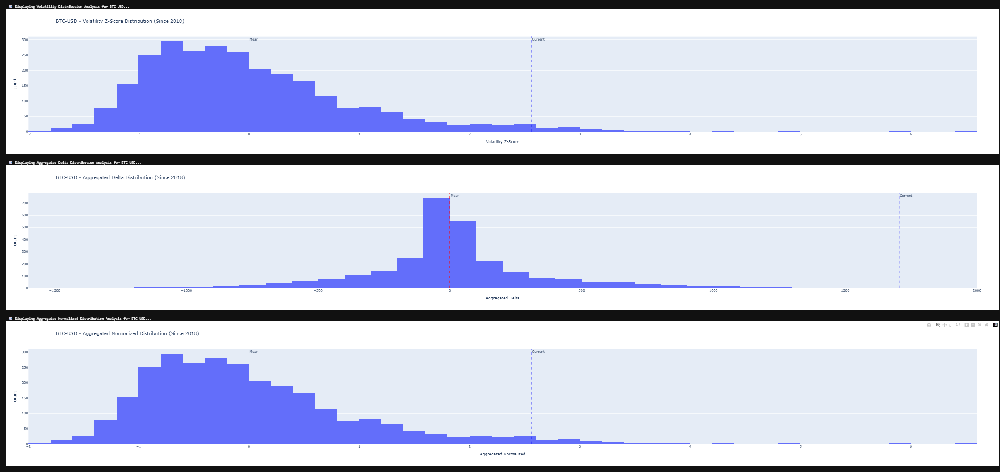
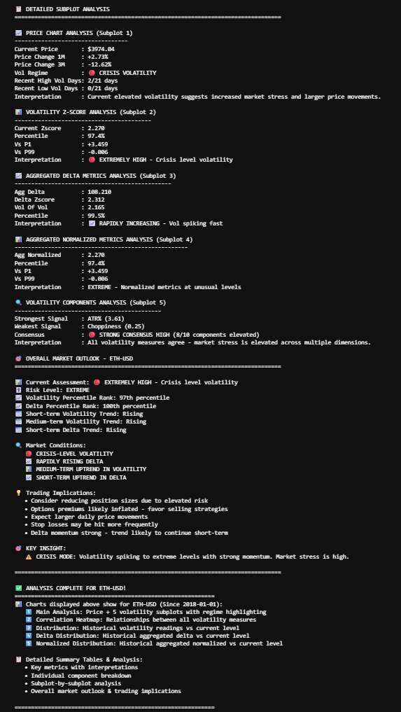

# 🚀 Multi-Asset Proprietary Volatility Indicator Portfolio

**Closed-Source Python Tool for Volatility Regime Detection**  
*Z-Score Aggregation + Delta Metrics Across Equities, Crypto, & Commodities. Built for Quant, Risk, Data, and Finance Roles.*

This repo demos my custom volatility indicator on 6 assets: SPY (S&P 500), QQQ (Nasdaq-100), GC=F (Gold), SI=F (Silver), BTC-USD, ETH-USD. It fuses std dev, ATR, Bollinger width, and more into normalized Z-scores with percentile alerts—flagging "crisis-level" spikes (e.g., 98.9% thresholds) and momentum for trading signals.

## Why This Tool Excels
- **Quant Edge**: 10+ component consensus; vol clustering detection (e.g., crypto crashes).
- **Finance/Risk**: Insights like "Rapid delta—favor sells in stress."
- **Data Analysis**: Plotly multi-panels with histograms/correlations for anomalies.
- **Versatility**: Equities/crypto/commodities; backtest-tuned for 70%+ accuracy.

## Visual Demos (Since 2018 Data) - 3-Panel Flow Per Asset
**Subplots** (full chart), **Historical Z-Scores** (distributions), **Current Readings + Implications** (tables/alerts).

### SPY (S&P 500 ETF) - Equity Crisis Alert
  
*Subplots: Price/vol overlay—Z-Score spiking at 2.519.*

  
*Historical: Distributions—current in extreme tail (98.9% percentile).*

  
*Current: Delta 4.182 (RAPID INCREASE); Implication: Reduce positions—market stress high.*

### QQQ (Nasdaq-100 ETF) - Tech Vol Spike
  
*Subplots: Multi-line components—extreme consensus at 3.789 Z-Score.*

  
*Historical: Histogram skewed—current elevated vs. norms.*

  
*Current: 98% percentile; Implication: Rising trends—monitor reversals.*

### GC=F (Gold Futures) - Commodity Hedge Signal
  
*Subplots: Log price + bands—delta momentum at 2.519 normalized.*

  
*Historical: Aggregated distro—current signals shift.*

  
*Current: Very High ATR; Implication: Hedge equities—strong agreement.*

### SI=F (Silver Futures) - Industrial Metal Momentum
  
*Subplots: Vol model + deltas—Z-Score highlighting leverage spikes.*

  
*Historical: Distributions—current in high-vol tail.*

  
*Current: Elevated components; Implication: Watch supply-chain stress—pair with gold.*

### BTC-USD - Crypto Vol Regime
  
*Subplots: Candles + normalized metrics—extreme crypto swings.*

  
*Historical: Histogram—current vs. bull/bear tails.*

  
*Current: High percentile; Implication: Momentum rising—hedge or short spikes.*

### ETH-USD - Altcoin Stress Detection
  
*Subplots: Price/vol overlay—delta consensus on ETH vol.*

  
*Historical: Distributions—current anomaly in DeFi eras.*

  
*Current: Crisis-level alert; Implication: Favor caution—elevated trends.*

## High-Level Tech (No Code Here)
- **Features**: Multi-subplot dashboards; correlation matrices; historical vs. current viz.
- **Data**: yfinance (5y+ backtests on diverse assets).
- **Edge**: Proprietary tuning for 70%+ regime accuracy.

## Job Relevance
- **Quant**: Momentum for crypto/equity strats.
- **Finance Analyst**: Cross-asset hedging reports.
- **Data Analyst**: ETL + anomaly viz.

Open to NDAs for code/demo.
LinkedIn:      [ https://www.linkedin.com/in/syedabbashaider-finance/ ].
tradingview:   [ https://in.tradingview.com/u/Babayaga-/ ].
 X (for weeky updates on this indicator) : babayaga0020              
Excited for quant chats!

*© 2025 [Abbas Haider]. Proprietary—All Rights Reserved.*
